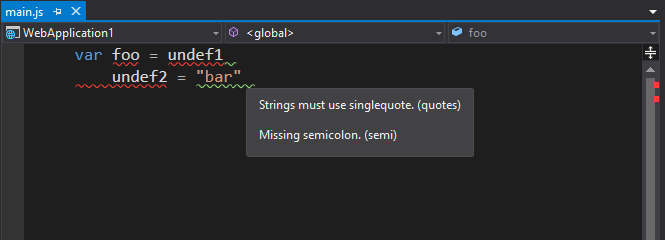
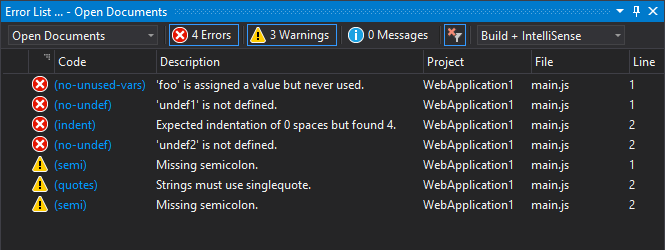

# VisualLinter

[](https://ci.appveyor.com/project/jwldnr/visuallinter)

Visual Studio JavaScript linter using [ESLint](https://github.com/eslint/eslint).

Download this extension from the [VS Gallery](https://marketplace.visualstudio.com/vsgallery/a71a5b0d-9f75-4cd2-b1f1-c4afb79a0638)
or get the [CI build](https://vsixgallery.com/extension/21d9f99b-ec42-4df4-8b16-2a62db5392a5/).

---------------------------------------

See the [change log](CHANGELOG.md) for changes and road map.

## Table of Contents

- [Features](#features)
- [Getting Started](#getting-started)
- [Language Support](#language-support)
- [Troubleshooting](#troubleshooting)
- [Known Issues](#known-issues)
- [Contributing](#contributing)
- [Inspiration](#inspiration)

## Features

- Lint files using ESLint on file open/save
- Visually mark errors/warnings in open document
- Include tooltip content with info on errors/warnings



- Fully integrated with Visual Studio error list



## Getting Started

##### Requirements

- ESLint installed locally (per project) _or_ globally (ESLint added to `PATH`)
- A valid configuration located in the current project directory (local) _or_ your user home directory (`~/.eslintrc`, global)

##### Notes

The default behavior is set to use a local ESLint installation and config.
If you instead wish to use a global installation and/or config, you can enable each respective option in Visual Studio under `Tools` > `Options` > `VisualLinter`.

Please note that enabling the option `Use global ESLint installation instead of local` has no effect on the use of a config file (and vice versa).
A local config will still be used unless `Use personal ESLint config instead of local` is also enabled in options.

The closest installation/config found relative to the file being linted will always be used.
If no `node_modules` directory or `.eslintrc` file is found in the same directory as the file being linted, `VisualLinter` will try and resolve the paths from ancestor directories up to, and including the root directory (e.g. `C:\\` on Windows).

For instance, suppose you have the following structure:

```
your-project
├── .eslintrc
├─┬ lib
│ └── source.js
└─┬ tests
  ├── .eslintrc
  └── test.js
```

When `source.js` is being opened or saved the `.eslintrc` file at the root of the project will be used as its config.
When `test.js` is being opened or saved the `.eslintrc` file in the `tests/` directory will be used as its config.

If there are multiple config files in the same directory, `VisualLinter` will only use one. The priority order is:

1. `.eslintrc.js`
2. `.eslintrc.yaml`
3. `.eslintrc.yml`
4. `.eslintrc.json`
5. `.eslintrc`

Currently, VisualLinter does NOT support the use of `package.json` as its config file.

Please note that additional ESLint plugins may be required in order to lint files depending on your configuration.
The VisualLinter output window will help identify these plugins, if any.

## Language Support

| Language | File Extensions | Required Plugins |
| --- | --- | ---- |
| HTML | `.html` | [`eslint-plugin-html`](https://github.com/BenoitZugmeyer/eslint-plugin-html) |
| JavaScript | `.js` | No additional plugins required! |
| Reactjs |`.jsx` | [`eslint-plugin-react`](https://github.com/yannickcr/eslint-plugin-react) |
| Vuejs | `.vue` | [`eslint-plugin-vue`](https://github.com/vuejs/eslint-plugin-vue) |

You can enable or disable each respective language in Visual Studio under `Tools` > `Options` > `VisualLinter`.

By default only JavaScript `(.js)` is enabled.

## Troubleshooting

- If you're using a global installation of ESLint and you're sure you've added ESLint to `PATH` but still receive an error saying that ESLint could not be found in `PATH`, restarting your computer would reload the environment variables.
- If you receive a message saying that ESLint could not verify your configuration, refer to the docs on [how to configure ESLint](https://ESLint.org/docs/user-guide/configuring)
- Visual Studio 2017 has built in ESLint support but does not visually mark errors in buffer. If you're seeing duplicate messages in the error list window, you can disable the built in features by changing the following options:

| Option | Value | Location |
| --- | --- | ---- |
| Enable ESLint | `false` | Options -> Text Editor -> JavaScript/TypeScript -> ESLint |
| Enable JavaScript errors | `false` | Options -> Text Editor -> JavaScript/TypeScript -> Code Validation |

Please note that VisualLinter is a direct replacement for both options.

## Known Issues

- None

## Contributing

⇄ Pull requests and ★ Stars are always welcome.  
For bugs and feature requests, please create an issue.

Check out the [contribution guidelines](.github/CONTRIBUTING.md) if you want to contribute to this project.

[See all contributors on GitHub.](https://github.com/jwldnr/VisualLinter/graphs/contributors)

## Inspiration

- [SonarSource/SonarLint](https://github.com/SonarSource/sonarlint-visualstudio) extension for Visual Studio.
- [AtomLinter/linter-eslint](https://github.com/AtomLinter/linter-eslint/) package for the Atom text editor.

## License
[MIT](LICENSE)